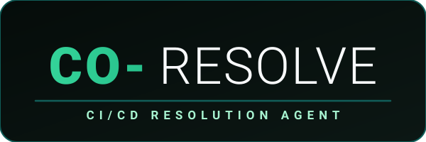
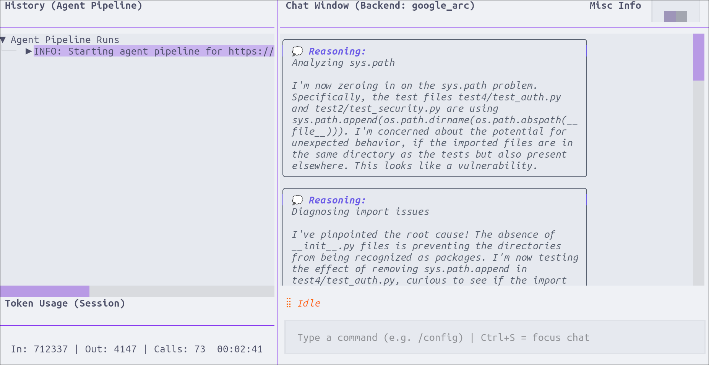
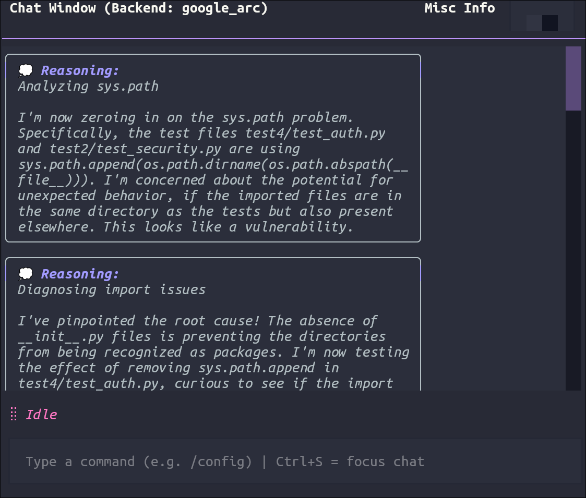
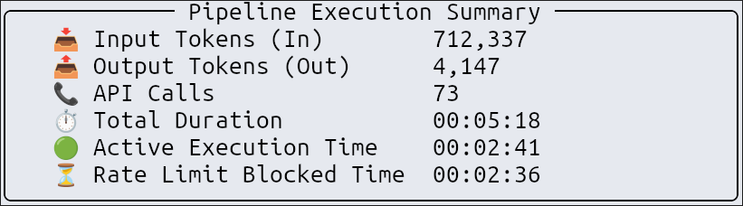

<p align="center">
  
</p>
<div align="center">
  
  <br>
  <i>Main dashboard overview</i>
</div>

Co-Resolve is an autonomous, self-correcting CI/CD resolution agent designed to scan, diagnose, test, and automatically patch software defects. Built around the **Agent-as-Runtime (AAR)** pattern, Co-Resolve integrates LLM-driven orchestrators with isolated Docker sandbox validation runtimes and FastAPI webhook servers to close the feedback loop between failed CI builds and automatic code resolution.

Through its multi-agent dynamic routing architecture, Co-Resolve intercepts webhook triggers from Git repositories, clones the codebase, executes security lints and test suites in a secure Docker container, resolves failures, verifies files locally, and automatically pushes clean, tested resolution patches back to remote pull request branches.

## Architectural Showcase

Co-Resolve was iteratively developed, with 3 final architectures  being highlighted. They can each be selected by using `/switch 1-3` within the TUI-Console:

| Name | Use Case | Description | Additional Features |
| :--- | :--- | :--- | :--- |
| `basic_arc` | Legacy Baseline (not recommended) | Only included to highlight improvements thanks to `openai_arc` and `google_arc`. | Synchronous prompt-loop execution and basic import shadowing detector. |
| `openai_arc` | OpenAI-SDK compatible API | Handles multi-turn conversations, manual approval gates, and local knowledge base formatting. Supports Google-API as well but only through a translation layer to the OpenAI-format. | Stateful multi-turn chat history tracking, human-in-the-loop (HitL) execution gates, and local RAG knowledge base integration. |
| `google_arc` | Google Gen AI SDK compatible API | Direct integration with the native Google API using the new `google-genai` SDK, featuring server-side state and context preservation instead of client-side context management. | Server-side token/context preservation via native Google SDK, and model-native thought signature preservation. |
---
### Performance Comparison
By switching to the **GenAI SDK** (which handles things like stateful management and implicit caching) there were *noticeable* performance gains across **3 different TUI pipeline runs** using the [test repo](https://github.com/ZenDoesCoding/cr_testing_template):
| Metric | openai_arc | google_arc | Difference (+/- %) |
| --- | --- | --- | --- |
| **Input tokens** | 329,611 | 209,002 | -37% |
| **Output tokens** | 2,357 | 2,197 | -7% |
| **API calls** | 46 | 41 | -10% |
| **Pipeline duration** | 1:39 (99s) | 1:31 (91s) | -8% | 

## Key Features

- **Docker Sandbox Validation**: Spawns isolated container runtimes to safely build dependencies, run test suites, and execute linting commands before committing patches.
- **Vulnerability Security Scanning**: Incorporates custom Semgrep rules mapping common security flaws (Timing Attacks, SQL Injection, Cryptography bypasses) across Python, PHP, Elixir, Ruby, and C#.
- **Human-in-the-Loop (HitL) Approvals**: Agent can recommend additions to the RAG for very specific issues. 
- **GitHub Webhook Server**: Captures GitHub push and pull request webhook events, triggering the agent pipeline.
- **Local Performance Benchmarking**: Runs 3 pipelines after each other to better assess performance of each architecture
- **Interactive TUI Dashboard**: 
  - Vim-style keybindings (`j`/`k` for navigation, `y` for line yanking)
  - Real-time log scrolling
  - **quickly load aesthetic themes (Catppuccin, Nord, Dracula, etc.)**:

  <div>
    
    <br>
    <i>Preview of dark mode theme in the dashboard</i>
  </div>

  - Neatly formatted **statistics (tokens/cost and time)**:

  <div>
    
    <br>
    <i>Pipeline summary after finishing</i>
  </div>


## Directory Layout

```
co_resolve/
├── README.md                 # System overview, setup, and first steps
├── agent_knowledge.json      # Dynamic knowledge store for coding pattern recognition
├── config.yaml               # Agent and TUI config settings (TUI themes, token limits, etc.)
├── benchmark.py              # Central script to run system performance benchmarks
├── analyze_benchmarks.py     # Script to compile and graph benchmark results
├── requirements.txt          # Python dependencies
├── architectures/            # Different agent pipeline implementations
│   ├── basic_arc/            # Pre-PR validation gate, import shadow checks, and git status sync
│   ├── google_arc/           # Native Gemini API using google-genai SDK, stateless mode, and signature preservation
│   └── openai_arc/           # Human-in-the-Loop, KB integration, async thread pools, and FastAPI hooks
├── core/                     # Common core libraries
│   ├── context_builder.py    # Code repository parser and mapping utilities
│   ├── knowledge_manager.py  # Patterns database parser and prompt formatter
│   ├── orchestrator.py       # Dynamic router that directs tasks to selected ARC
│   └── llm_client.py         # Dynamic proxy for tracking LLM token metrics
├── execution/                # Code sandbox execution framework
│   ├── sandbox.py            # Docker validation container runner (executes patches & tests)
│   └── tools.py              # Low-level file edit and replace utilities
├── interfaces/               # User and Webhook interfaces
│   ├── app.py                # Main TUI app entry point (launches docker + CoResolveTUI)
│   ├── tui.py                # Full-featured Textual Terminal User Interface
│   ├── tui_only.py           # Simplified TUI interface
│   ├── api.py                # FastAPI web server hosting webhook routes
│   └── webhook.py            # FastAPI router handling GitHub webhook push events
├── semgrep_rules/            # Custom Semgrep scanning rules mapped to Python, PHP, Ruby, etc.
│   └── ...
├── services/                 # Integrations
│   └── github_client.py      # Git wrapper and PRService for GitHub integration
└── utils/                    # Utility scripts
    ├── active_arc.py         # Set or get active routing architecture
    ├── config.py             # Settings loader and secret manager
    ├── config_manager.py     # YAML configuration manager
    └── docker_helper.py      # Docker daemon validation and startup helper
```

---

## Dependencies

Co-Resolve is built using Python 3.10+ and integrates the following primary modules:

1. **`google-genai` & `openai`**: SDKs to interface with LLM providers.
2. **`textual` & `rich`**: Generates the modern terminal UI console and live benchmark metrics charts.
3. **`fastapi` & `uvicorn`**: Hosts the local REST endpoints and webhook listeners.
4. **`docker`**: Connects to the host daemon to spin up sandboxed environments for test execution.
5. **`PyGithub`**: Communicates with the remote GitHub API to pull branch metadata and push resolved commits.

---

## Test repo
You can fork the [test repo](https://github.com/ZenDoesCoding/cr_testing_template) (all steps provided within README) in order to try co_resolve without using your own code base!  
4 uncommon bugs included that result in 4 failed tests.  

> **NOTE:** LLM-based code resolution is stochastic. If a test case fails to resolve, consider utilizing a more capable model with better reasoning or populating the local RAG with debugging patterns for that specific point of failure.

## First Steps

Follow these steps to get Co-Resolve set up and running on your system:

### 1. Prerequisite Setup
Make sure you have Docker installed and running. Co-Resolve automatically checks the Docker daemon status on launch.
```bash
docker --version
```

### 2. Install Dependencies
Initialize a Python virtual environment and install the required modules:
```bash
python -m venv venv
source venv/bin/activate
pip install -r requirements.txt
```

### 3. Environment Configuration
Create a `.env` file in the root directory and specify your API credentials:
```bash
GITHUB_TOKEN="your_github_token_here"
OPENAI_API_KEY="your_openai_key_here"
GEMINI_API_KEY="your_gemini_key_here"
```

You can customize execution parameters (like TUI theme, request limits, or sandbox attempts) in `config.yaml`.

### Optional: Knowledge Base (RAG) Setup
Co-Resolve supports an optional, very lightweight Retrieval-Augmented Generation (RAG) knowledge base. The contents of the RAG are simply prepended to the prompt given to the model. It's made up from either manual entries by the user or lessons from past bug fixes. Because this RAG doesn't use semantic search it's not recommended to be used for large RAG's, because otherwise the context window would explode.

By default, the agent runs without any pre-loaded knowledge if the file is missing. To enable it, create a file named `agent_knowledge.json` in the root directory:

```json
{
  "entries": [
    {
      "id": "kb-001",
      "timestamp": "2026-07-03T12:00:00Z",
      "pattern": "Mutable default argument in function signature (e.g. def foo(cache={})).",
      "problem": "State leaks across different function invocations leading to shared cache side effects.",
      "solution": "Use None as the default value and instantiate the dictionary inside the function instead.",
      "language": "python",
      "source_repo": "owner/repo",
      "source_commit": "abcdef12"
    }
  ]
}
```

#### Automatically Populating the Knowledge Base
During active runs (in turbo mode), if the agent successfully fixes a bug, it automatically extracts the underlying pattern and appends it to `pending_knowledge.json` as a candidate. You can review and promote these candidates to the main `agent_knowledge.json` by executing the `/approve_knowledge` command in the interactive Textual TUI.


### 4. Launch the Interactive Dashboard (TUI & Webhook)
To launch the Textual dashboard interface:
```bash
python interfaces/app.py
```
> [!NOTE]
> Launching the TUI dashboard automatically starts the FastAPI webhook API server on port `8000` as a background subprocess. You do not need to start Uvicorn separately when running the dashboard.

### 5. Expose Webhooks via Tunnel (ngrok)
To capture push/workflow webhook events from remote GitHub repositories on your local server:

1. **Expose port 8000 to the internet**:
   ```bash
   ngrok http 8000
   ```
2. Copy the generated public HTTPS forwarding URL and configure it in your GitHub repository's Webhook settings (e.g., `https://<your-ngrok-subdomain>.ngrok-free.app/api/webhook`).

***


### Run System Benchmarks
To evaluate the success rates and token usage metrics of different routing architectures you can use:
```bash
python benchmark.py
```

---

## Planned Features

- [ ] Support GitLab webhooks.
- [ ] Add a chat widget in the TUI to query the agent directly during runs (HITL).
- [ ] RAG with semantic search by using embedding model for each entry of the knowledge base.